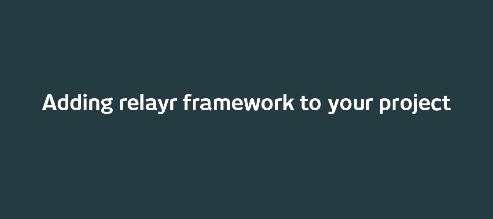

Introduction
------------

This repository contains the code to build the Relayr Framework for iOS and OS X. The *RelayrSDK* project generates a product called `Relary.framework` that depending on your target can be run on the mac or on an iOS device.

Currently the only dependecy of the project is the PUBNUB library and if you want to build the framework **for iOS devices, you need Xcode 6 and iOS 8**, since embedded Frameworks have only been introduced to iOS 8 enable devices. For the Mac, you can still use Xcode 5.

Build process
-------------

There are two options at the time to use the `Relayr.framework`.

* Get the *.framework* file and drag and drop it into your project.

  1. First you need to download or generate the `Relayr.framework` file.
     
     
  
  2. Drag and drop the file into your project and be sure that the framework shows up in both *Embedded Binaries* and *Linked Frameworks and Libraries*.
     
     

* Integrate the *RelayrSDK* project as a subproject of your workspace and drag and drop the product into the *Embedded Binaries* tab of your project.

  

Usage
-----

The `Relayr.framework` has a small subset of useful classes.

### Web features

The Relayr framework can call the Relayr servers for information on apps, users, transmitters, devices, etc. It is worth noticing that all these calls are asynchronous and the answers take an amount of time proportional to the quality of your connection and the size of the response asked for.

* `RelayrCloud.h`. It is used as a static class to check up several status from the Relayr Cloud.

  ```objective-c
  [RelayrCloud isReachable:^(NSError* error, NSNumber* isReachable){
      if (isReachable.boolValue) {
          NSLog(@"The Relayr Cloud is reachable!")
      }
  }];
  ```

* `RelayrApp.h`. It represents a Relayr Application. You can think of it as the representation of your iOS/OSX app in the Relayr Cloud. You create an object with the *appID*, *OAuthClientID*, *OAuthClientSecret*, and *redirectURI* given to you when you create a Relayr Application in [developer.relayr.io](https://developer.relayr.io).

  ```objective-c
  [RelayrApp appWithID:@"..." OAuthClientID:@"..." OAuthClientSecret:@"..." redirectURI:@"..." completion:^(NSError* error, RelayrApp* app){
      if (app) {
          NSLog(@"Application with name: %@ and description: %@" app.name, app.description);
          self.app = app;
      }
  }];
  ```
  
  You can look into the app properties, query the server for information related to the up, or more commonly to sign in and sign out users into your application.
  
  ```objective-c
  [self.app signInUser:^(NSError* error, RelayrUser* user){
      if (user) {
          [self.users addObject user];
      }
  }];
  ```

* `RelayrUser.h` represents a logged in users. Users can access data from devices or sent data to the cloud. They can check for transmitters/devices they own. Bookmark favorite devices or even become publishers. You can have as many logged in users as you want.

  ```objective-c
  RelayrUser* user = ...;
  NSLog(@"User with name: %@ and email: %@", user.name, user.email);
  
  // Lets ask the cloud for all the transmitters/devices own by this specific user.
  [user queryCloudForIoTs:^(NSError* error, NSNumber* isThereChanges){
      if (error) { return; }
      
      for (RelayrTransmitter* tran in user.transmitters)
      {
          NSLog(@"Transmitter's name: %@", tran.name);
      }
      
      for (RelayrDevice* dev in user.devices)
      {
          NSLog(@"Device's name: %@", dev.name);
      }
  }]
  ```

* `RelayrTransmitter.h` instance represents a ----- that connects to sensors (usually BLE) to the Relayr Cloud. For example, the Wunderbar is composed of 7 pieces: 1 Transmitter (Master Module) and 6 BLE sensors. The transmitter takes the data from the 6 sensors and send it over MQTT to the Relayr Cloud. From there, that data is routed to any Relayr App/User interested on it.

* `RelayrDevice.h` represents a sensing device. A single Relayr device can *sense* many values at the same time. Thus, you should always query for the capabilities of the device.